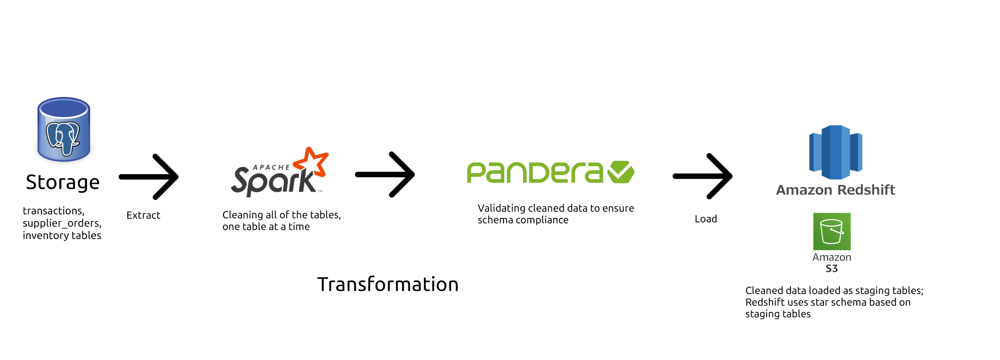

# Grocery Store Analytics Pipeline

This is a batch data pipeline that powers a dashboard which uses a few KPIs that focus on several areas in the operations of a grocery store chain. All of the data used in this project is generated by Claude in a static database format.

You can check out the dashboard [here](https://peter-v-grocery-dashboard-project.streamlit.app/), and the dashboard's repository [here](https://github.com/petervlaskovits/grocery-dashboard).

## Architecture Discussion



My pipeline is basically a ETL pipeline that full loads all tables into Spark, transforms all of the dirty data in each table, then is validated in accordance with a Pandera schema, before the tables are downloaded as a Parquet file and loaded into an S3 bucket, where it becomes loaded as staging tables in a Redshift database. All of this is done on a weekly cron schedule that starts the pipeline every Friday at 8:00 AM.

Since this pipeline would be running weekly, I opted for full load because the data being loaded isn't very big to begin with. However, if the pipeline faced a much larger data volume, I would opt for an incremental load approach instead so that the source system doesn't break when my pipeline is loading everything all at once. 

I opted to use Spark for the transformation/cleaning layer instead of Pandas or Polars because if Pandas/Polars was used, the sheer volume from all of the tables being loaded would be too much for Pandas/Polars to handle.

After all of the data is cleaned, I used Pandera to validate all of the data in accordance to a schema defined by myself. This would eventually be used for CI/CD to test out any changes to the pipeline; however, since I was on a tight time constraint to finish up this project, I opted to not include it in the first publishment of this project. That being said I plan on implementing CI/CD later.

### Warehouse Data Model

My data model is a star schema, which is used because I wanted to make it easy for data analysts to interact with the data while being organized into tables based on several KPIs that will be used in the dashboard:

* Product Return Rate %
* Supplier Fill Rate %
* Gross Margin
* Product Average Days on Shelf

```dim_supplier``` and ```dim_store``` use SCD Type 2 because supplier names can change due to rebrands and mergers, while store names may change names in the future. I was placing historical analysis in mind because if those two dimensions used SCD Type 1, a lot of history would be lost and it would be difficult to analyze historical queries if a supplier rebrands or merges with another supplier. The other dimensions (```dim_category``` and ```dim_product```) are SCD Type 1 because product and category names rarely change at all.

### EDA 
Before developing my pipeline, I did some exploratory data analysis on the data to see what data quality issues each table had so I can think about my strategy to transform each messy column within the tables. The EDA notebooks can be found in ``src/eda_notebooks``.